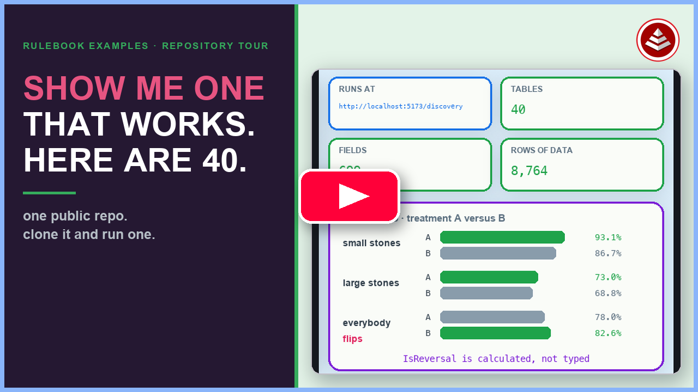

# effortless-rulebooks

**One repo, one shape.** This repository is a catalog of Effortless projects — and it is itself an Effortless project. Every governed project is moving toward the same explicit contract, so the generated rulebook editor, the root explorer at `http://localhost:42440`, and an LLM with the skill suite can work with each project consistently.

## Watch the repository tour

[](https://www.youtube.com/watch?v=e_ph8mlg47M)

▶ [**Play: Show Me One That Works. Here Are 40. | Effortless Rulebooks Tour**](https://www.youtube.com/watch?v=e_ph8mlg47M)

An eight-minute tour of everything in this checkout, for someone who has never heard of Effortless. It opens the smallest project, [customer-fullname](toy-rulebooks/customer-fullname/), where three columns are typed and a fourth is a rule, then follows that single line through one build into a Postgres function, a view, and a plain-English sentence. From there it measures the real range: [star-trek](toy-rulebooks/star-trek/) at 11 tables and about a thousand rows, [simpsons-paradox](rulebook-examples/simpsons-paradox/) at 40 tables and 8,764 rows with 411 of its 699 fields calculated rather than typed. It shows that projects register whatever tools they want (two for one, eighteen for another) and closes on the read, run, change, build loop and the one sentence that hands the whole thing to a coding agent.

The repo's own rulebook, [effortless-rulebook/effortless-rulebook.json](effortless-rulebook/effortless-rulebook.json), governs the whole thing. It lists every governed project including the root, the canonical project-shape rows, strict filesystem/manifest witnesses, consistency rules and findings, skills, routes, and the delivery programme. Readiness and toy/example classification are derived from those witnesses and must not be inferred in app code.

The active continuation is [Platform Explorer and Repository Consistency Plan](PLATFORM-EXPLORER-PLAN.md): promote the root rulebook, generated editor, and a new root React explorer; make `./start.sh` universal across the root, toys, and examples; and record the successor of each legacy-runner capability while the runner stays an ordinary example.

## Start the root experience

```bash
./start.sh
```

The root launcher cleanly restarts the Phase 2 React shell and generated
rulebook editor, validates the generated business views, and prints every
service URL:

- root explorer: `http://localhost:42440`
- generated API: `http://localhost:42441`
- generated editor: `http://localhost:42442`

Run `./start.sh stop` to stop the root-owned services. Every governed toy and
example uses the same `./start.sh` command from its own project directory.

## The shape

Every project — the root included, the legacy runner included — fills the same slots:

| Slot | Where |
|---|---|
| Build manifest | `effortless.json` |
| The hub (single source of truth) | `effortless-rulebook/effortless-rulebook.json` **or** `effortless-rulebook/<slug>-rulebook.json` — both are valid |
| Project metadata | the `__meta__` table inside the rulebook |
| Story | `README.md`, ending with the *Local transpiler bus* section |
| Doctrine marker | `CLAUDE.md` (required of showcase examples) |
| Plain-English rules | `rulespeak/` via `rulebook-to-rulespeak` |
| Reference substrate | `postgres/` via `rulebook-to-postgres` + `init-db.sh` (examples) |
| Editor | `effortless-rulebook/edit-rulebook.sh` via `effortless-rulebook-editor` (examples) |
| An app that reads the views | `app/`, `web/`, `server/` … (examples) |
| Run story | `start.sh` (root, toys, and examples) |

`ProjectLayoutSlots` is the authoritative contract and `ProjectSlotWitnesses` records one strict observation per governed project and slot. The resulting `vw_rulebook_domains` columns derive coverage, readiness, toy/example classification, and misfiling.

## The map

```
effortless-rulebooks/            ← the platform IS the repo; itself a project
├── effortless.json
├── effortless-rulebook/effortless-rulebook.json   ← the governing rulebook
├── rulespeak/  postgres/  progress-report/  docs/  ← this project's outputs
├── rulebook-examples/<slug>/    ← fully implemented showcase projects
│   └── legacy-runner/           ← the former platform runner, kept as an ordinary example
│                                   after useful capabilities have an explicit home
└── toy-rulebooks/<slug>/        ← projects that implement a piece or two
```

Two physical folders, one concept: in the rulebook they are all project rows. `Kind` declares whether a project is the root, a toy or an example; `Area` records physical placement only. `IsFullyImplemented`, `ReadinessState`, `ExpectedArea`, and `IsMisfiled` are derived from witnessed slots against the declared kind.

## Working with any project

```bash
cd <project>                      # the root, an example, a toy — same commands
effortless build                  # regenerate every registered output from the rulebook
./start.sh                         # cleanly restart the declared local experience
```

Edit the rulebook JSON; everything else is derived. Read computed values from the `vw_<table>` views, never recompute them.

At the repository root, refresh and validate project conformance with:

```bash
python3 scripts/scan-project-slots.py effortless-rulebook/effortless-rulebook.json .
scripts/validate-rulebook.py effortless-rulebook/effortless-rulebook.json
```

The scan records exact failures as findings and exits nonzero for malformed or ambiguous project artifacts.
The root build's final step runs `scripts/init-root-db.sh` against the explicit
`erb_effortless_rulebooks` database. On a first checkout, create that empty local
database once with `createdb erb_effortless_rulebooks`; the build fails loudly if
it is absent and never uses the generated `demo` default.

## Where the repo's health lives

After `effortless build` at the root, the database `erb_effortless_rulebooks` holds the governing rulebook's views:

- `vw_project_metadata` — one row with findings/rule/programme fields plus `layout_slot_count` and `fully_implemented_count`.
- `vw_rulebook_domains` — one row per governed project with `slot_coverage_percent`, `required_slot_coverage_percent`, `is_fully_implemented`, `is_toy_by_coverage`, `readiness_state`, `is_misfiled`, `open_finding_count`, and `consistency_grade`.
- `vw_project_layout_slots` and `vw_project_slot_witnesses` — the canonical contract and exact observed pass/gap evidence.
- `vw_project_launch_profiles` and `vw_project_local_services` — exact working directories, commands, experiences, localhost URLs, and health contracts.
- `vw_consistency_findings` — the sweep work queue, with a derived `priority` (P1/P2/P3).
- `progress-report/progress-report/progress-report.html` — the delivery report rendered from the story corpus.

## The legacy runner

[rulebook-examples/legacy-runner/](rulebook-examples/legacy-runner/) is the way the platform used to run every project: the CLI menu, the `ssotme-proxy` bus (`:4242`), the execution substrates and conformance harness, and the former admin portal (`:7777`). It stays as an ordinary example, no longer privileged. The root explorer (`./start.sh` at the repository root) covers its discovery and guidance role, and the effortless CLI is absorbing the bus; the root rulebook's `LegacyRunnerCapabilities` records each successor. See the [active plan](PLATFORM-EXPLORER-PLAN.md).

## Skills

The `effortless-*` Claude skill suite is modeled in the root rulebook (`ClaudeSkills`, `SkillRoutes`) and mirrored into [docs/skills/](docs/skills/) on every build. Load `effortless-orchestrator` first in any project here.

---

## Local transpiler bus (`localhost:4242`)

> **All 13 local transpilers live on `localhost:4242`.** Start the bus with
> `./start.sh` from `rulebook-examples/legacy-runner/ssotme-proxy/` (it is being
> separated into its own project; see the root rulebook's `LegacyRunnerCapabilities`).
> The ssotme-proxy then exposes every repo-local transpiler —
> `postgres-calculated-to-rulebook`, `rulebook-to-python`, `rulebook-to-golang`,
> `rulebook-to-cobol`, `rulebook-to-owl`, and more — as first-class `ssotme://`
> routes any `effortless build` can call.

This is the current launch path. The effortless CLI is absorbing the bus (`effortless serve`, refactor Step 12); until then the runner’s `ssotme-proxy` is the live bus.
