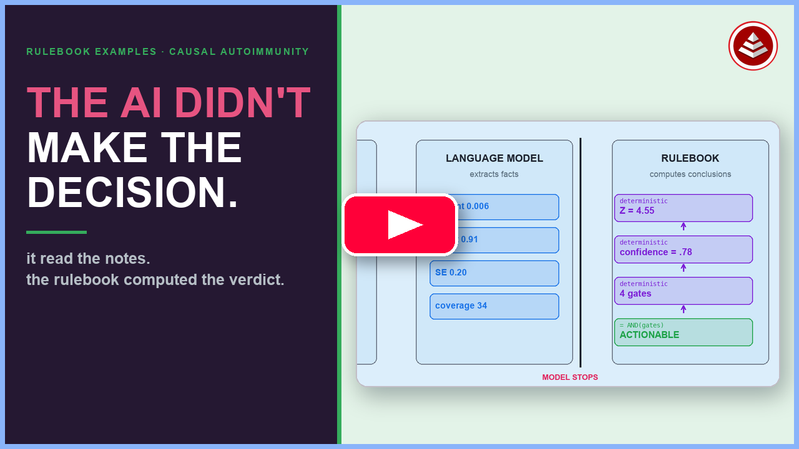
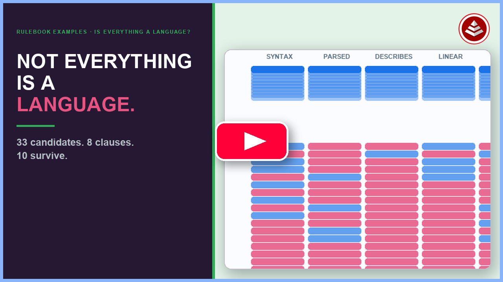

# Rulebook Examples

These are full domain ontologies — real subject matter, real depth, built with the full suite of licensed `rulebook-to-xyz` tools. Each one tells its own story entirely through a rulebook.

The pattern is consistent: one person, one rulebook, roughly a weekend of work. The complexity here is the complexity of the domain, not the cost of building it. The commit history for any of these projects is a log of *intent evolving* — each commit a named conceptual step, generated artifacts not mentioned because they rebuilt automatically.

Because this repo is also used as a live demonstration environment, some domains may show partially-completed loop steps at any given moment. A full `effortless build` on any domain resets it to its defined state.

If you want the substrate breadth demos — one tiny domain run through 17 runtimes — those are in [toy-rulebooks/](../toy-rulebooks/).

---

## The domains

### `causal-autoimmune-architecture` — *grand-challenge complexity, one falsifiable boolean*

A grand-challenge prompt — infer the complete causal architecture of a heterogeneous autoimmune disease from a million-person multi-omic cohort — reduced to a single calculated-field DAG. The verdict (`IsActionable`) is computed from raw observations alone; nothing is hand-entered.

#### Watch the repository tour

▶ [**Play: The AI Didn't Make the Decision. The Rulebook Did. | Causal Autoimmunity**](https://www.youtube.com/watch?v=dNoe_yQuWSg)

The revised walkthrough separates model-extracted facts from rulebook-derived conclusions, explains
the four medical evidence gates in plain English, and follows failures, recomputation, provenance,
negative controls, and an emergent patient cluster back to their source facts.

What this demonstrates:
- **Transparency as architecture.** Every Z-statistic, every gate, and the keystone verdict are inspectable formulas — the judgment that would otherwise hide inside a model is externalized into editable cells.
- **The trust boundary is a line in the graph.** Everything above the raw leaves is a pure formula; everything below is a raw observation.
- **Disease state machine.** A patient's progression is derived from longitudinal labs as a computed state, not a stored flag.
- **38 tables.** Multi-omic cohort data, federated datasets, variant types, ancestry-equitable predictions.

→ [causal-autoimmune-architecture/README.md](causal-autoimmune-architecture/README.md)

---

### `simpsons-paradox` — *scale, corpus depth, and witnessed invariants*

**96 published and synthetic studies** (medicine, epidemiology, law, sports, education, economics, social science) poured into a single rulebook entity model. Simpson's paradox **emerges** as a derived boolean — there is no `ReversalDetection` entity. `IsReversal`, `DistortionType` (five types A/B/C+/C−/D), `SignalPurity`, and `CorrectedWinner` all fall out of formulas declared in the rulebook.

What this demonstrates:
- **Corpus-scale derivation.** 960 allocation-sweep rows, 21 algebraic self-consistency invariants, all passing.
- **The paradox as data.** A philosophical puzzle becomes a computable, queryable fact — never modeled directly.
- **Witnessed build history.** The loop commits in this repo (`loop-05` → `loop-20`) show the rulebook evolving from blank to witnessed reversal in four named steps.
- **Full-stack derivation.** Rulebook → Postgres view chain → interactive Vite explorer UI.

→ [simpsons-paradox/README.md](simpsons-paradox/README.md)

---

### `talismans-special-solutions` — *multi-substrate conformance, ontology generation, live sync*

Inspired by Jessica Talisman's four-part ontology series. One rulebook generates: a Postgres database, a Python reasoner, an OWL ontology with SHACL rules, a SPARQL endpoint, an explainer DAG, and a React admin portal — all deriving the same computed answers.

What this demonstrates:
- **Multi-substrate conformance.** Postgres and the OWL reasoner independently compute `IsStale`, `SequencePosition`, `EscalationViolation`, and all 8 competency questions — answers match.
- **Live schema-drift visualization.** A triangle widget shows which store (rulebook head, reasoner, Postgres) is "ahead" at any moment; sync is direction-aware.
- **Semantic web portability.** The same business rules are simultaneously a relational schema, an OWL class hierarchy, and a set of SHACL constraints — derived, not hand-translated.

→ [talismans-special-solutions/README.md](talismans-special-solutions/README.md)

---

### `traffic-ticket-contest` — *state machines and a rules engine, both as data*

A universally-understood case-management domain (driver gets a ticket, may pay or contest it), chosen precisely because the interesting part is fully visible — it is all in the rules.

What this demonstrates:
- **Four computed state machines.** `CitationStatus`, `ContestStatus`, `PaymentStatus`, `LicenseStatus` — all calculated fields, never stored-and-mutated. Always correct because always re-derived.
- **Regulations as rows.** Every knob in `Jurisdictions` (`DaysToRespond`, `LatePenaltyPct`, `PointSuspensionThreshold`, …) is a data row. Change a number and every downstream citation re-derives its due dates and statuses.
- **55 tables, 194 conformance tests, 980 catalog fields.** An intentionally ordinary domain taken to full production depth.

→ [traffic-ticket-contest/README.md](traffic-ticket-contest/README.md)

---

### `effortless-math` — *the highest-status domain, and the trust boundary as data*

The ERB hub-and-spoke method pointed at mathematics itself. Fermat's Last Theorem is the deeply modeled flagship **consumer** theorem; seven deep number-theory results (analytic prime distribution / Chebotarev, Hilbert specialization, Mazur modular-curve arithmetic, global deformation duality, modular-curve cohomological comparison, universal Ribet level-lowering, solvable Artin automorphy) are first-class **provider** theorems. Consumers bind versioned provider certificates, never a provider's private tables.

What this demonstrates:
- **Proof status is data, not a boolean.** `IMPORTED`, `DECOMPOSED`, `DERIVED_WITH_IMPORTED_CHILDREN`, `DERIVED_WITH_SHARED_KERNEL`, `FULLY_INTERNALIZED_FOR_SCOPE`, `FALSIFIED`, `SUPERSEDED`, `NOT_EVALUABLE` are distinct, separately-witnessed facts. FLT sits at `DERIVED_WITH_IMPORTED_CHILDREN`: the contradiction is derived while seven children remain imported.
- **The trust boundary falls out of the DAG.** A conclusion is only as internal as its deepest load-bearing child; the boundary is reported, never hidden. This is CMCC's provenance-by-construction applied to the one domain where provenance is the whole game.
- **Category-honest by design.** It reproduces the frozen v21 answer key — 8 theorems, 7 load-bearing dependencies, 113 proof facts, 571 loops, 305 invariant rows, 1 derived contradiction, 0 providers fully internalized. It is a certificate/status **ledger and build system for a proof network**, NOT a prover, and never claims a zero-import proof of FLT. The bookkeeping of a proof decomposes cleanly into schema + data + lookups + aggregations + formulas; proof-*search* does not, and the project never claims it.

→ [effortless-math/README.md](effortless-math/README.md)

---

### `effortless-banking` — *deep domain, one lifecycle*

A full loan-origination lifecycle with an underwriting state machine, time-based covenant and DSCR/LTV monitoring, risk-grade migration, segregation-of-duties checks, and branching approval logic — expressed in the same rulebook primitives as every other domain here.

→ [effortless-banking/README.md](effortless-banking/README.md)

---

### `planar-unit-discovery` — *spatial reasoning at scale*

Spatial reasoning and unit discovery over plane geometry — 36 tables covering domains, contexts, points, and derivation chains.

→ [planar-unit-discovery/](planar-unit-discovery/)

---

### `tiling-the-plane` — *mathematical validity as a derived boolean*

A catalog of Euclidean plane tilings — which ones exist and *why* each one is valid — plus a generative engine that places tiles into a region and measures coverage. `VertexFigures.IsValid = (AngleGapDeg <= 0.0001)` — no one can mark a tiling valid by hand.

→ [tiling-the-plane/README.md](tiling-the-plane/README.md)

---

### `intelligence-taxonomy` — *a three-hop DAG in miniature*

A minimal domain: four agents classified by aggregating per-capability scores through a three-hop calculated-field DAG. Change one weight, rebuild, the whole classification re-derives. Deliberately three tables — the point is the classification logic, not the table count.

→ [intelligence-taxonomy/README.md](intelligence-taxonomy/README.md)

---

### `is-everything-a-language` — *philosophical ontology, formal predicates*

A philosophical meta-ontology exploring what qualifies as a "language" through 8-predicate AND logic and formal argument modeling. The argument is expressible as inspectable structure.

→ [is-everything-a-language/README.md](is-everything-a-language/README.md)

#### Watch the repository tour

▶ [**Play: Is Everything a Language? Eight Clauses, 33 Candidates, One Answer**](https://www.youtube.com/watch?v=SVofTPc8lkU)

The revised walkthrough makes the eight-clause gate concrete with English and a coffee mug, separates the syntax-tree and stable-reference tests, then pulls the honeybee waggle dance from the ragged list. Five disputed premises change on screen and the gate recomputes the verdict.

---

### `ross-style-business-rules` — *the keystone case for "only if" vs "iff"*

Five business rules re-encoded from a hand-correction by Ronald Ross. Built around one dataset row (`claim-D`) that proves why DR-5 must be "only if" and not "iff." The meaning is legible in the structure.

→ [ross-style-business-rules/README.md](ross-style-business-rules/README.md)

---

### `naive-set-theory` and `veritasium-power-laws-and-fractals`

In-progress domains. Both have project scaffolding; rulebook authoring is underway.

---

### `effortless-rulebooks`

Meta-ontology: the ERB orchestration project modeling itself.

→ [effortless-rulebooks/](effortless-rulebooks/)

---

## The invariant

Every domain here satisfies the same property: **if you deleted all the derived artifacts and kept only the rulebook JSON, a transpiler could regenerate everything else identically.** That property — not any specific substrate, not any specific domain — is what this collection is here to demonstrate.
