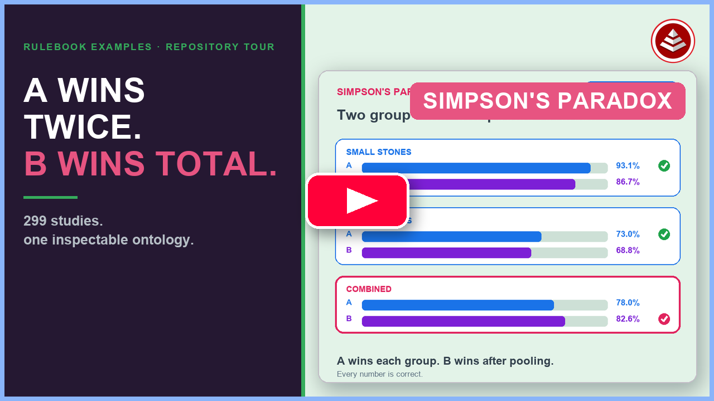

# Simpson's Paradox — Witnessed DAG Demo

A **witnessed dependency graph** that turns Simpson's paradox from a textbook curiosity into a computational object. **299 studies** (290 real, 9 synthetic) share one entity model — the original 238-study Simpson's-paradox corpus plus a **250-candidate control-corpus wave** of non-paradox studies across 25 additional domains, added specifically to test whether the instrument's geometry is a selection artifact or a real regularity. Every derived value falls out of formulas declared in the rulebook; modeling choices are centralized there, not scattered in app code. The paradox itself is never modeled — it **emerges** as a derived fact from raw counts.

## Watch the repository tour

[](https://www.youtube.com/watch?v=lZmS67gkUes)

▶ [**Play: A Wins Twice. B Wins Overall. | Rulebook Examples Tour**](https://www.youtube.com/watch?v=lZmS67gkUes)

The video follows this project's kidney-stone counts through the inspectable ontology until `IsReversal` emerges as a derived value, zooms out across the full 299-study corpus, and shows `H-econ-zero` being retired when new economics data breaks an earlier observation. It finishes with the repeatable loop: read the README, run the project, change one formula, run `effortless build`, and inspect every projection that follows.

**Start at `/discovery` or `/conclusions`.** Formal epistemic claims live in the rulebook `Conclusions` table — tiered by claim type (theorem · instrument · corpus snapshot). `DiscoveryHypotheses` split into **consistency checks** (definition-linked, e.g. H-purity) vs **corpus hypotheses** (contingent, provisional). SSoT is the rulebook JSON; the explorer reads `vw_*` views only. Run `./start.sh` → [Discovery Research](http://localhost:5173/discovery) · [Conclusions & Findings](http://localhost:5173/conclusions).

[`simpsons-paradox-summary.pdf`](simpsons-paradox-summary.pdf) is a static export of the same tiered state (regenerated on `./reset-rulebook-db.sh`). For framing caveats — geometric vs causal, deductive vs empirical, convenience-sample limits — see [What this is not](#what-this-is-not) below.

---

## What this is

An **Effortless Rulebook (ERB)** domain. The SSoT is `effortless-rulebook/simpsons-paradox-rulebook.json`. All other artifacts — Postgres SQL, views, OWL ontology, RuleSpeak, Explainer DAG, the explorer UI — are mechanically derived from it.

The paradox **emerges** from the model. It is not modeled directly. `IsReversal` equals `IsSignFlip`; both are derived booleans comparing pooled rates to per-stratum rates. There is no `ReversalDetection` entity.

The `Loops` table is the build history — each row documents what domain concept was introduced, which natural-language question it answers, and what was witnessed. It is the plan as well as the record: `Status=planned` rows describe queued work, so it is the single place to see both where the instrument came from and where it's going next. This README doesn't restate that log — it tells the shape of the argument the instrument makes.

---

## How the argument is built

The instrument was built as a sequence of small, falsifiable additions — never a batch redesign. Four moves matter more than the others:

1. **The paradox is derived, never declared.** `Studies → Strata → CaseCells` hold nothing but raw success/failure counts. `IsSignFlip`, `DistortionType`, `SignalPurity`, and every other diagnostic are formulas over those counts. There is no field anywhere that says "this study is a Simpson's paradox" as an input — only as an output.
2. **Geometry first, causality second, deliberately kept apart.** The instrument classifies *allocation distortion* from arithmetic alone. Whether it is safe to act on the allocation-corrected winner is a separate question, gated by `AdjustmentAppropriate` / `CausalClaimStatus` on `StratumVariables`. Berkeley 1973 is the proof case: high `AllocationDistortion`, but `CausalRole=contested` — the instrument classifies the geometry; the researcher supplies the causal account.
3. **Claims are tiered by how they were earned.** `Conclusions` rows tagged **theorem** (9 of them, e.g. the SignalPurity ceiling, CorrectedGap invariance, the Perfect Balance and Purity Inversion theorems) are true by definition — checked as invariants, not discovered empirically. Rows tagged **domain**, and the active `DiscoveryHypotheses`, are corpus statistics on a convenience sample: pre-registered before each expansion wave, reported as PASS/FAIL, never silently promoted to theorem status.
4. **Scale is used to stress-test the theorems, not just pad the count.** The 238-study Simpson's corpus proved the geometry on studies selected *for* paradox candidacy. The control-corpus wave adds studies selected for the *absence* of one, across 25 additional domains, specifically to check whether "Type-D is the dominant, safe basin" holds when the sample isn't paradox-biased. A synthetic wave adds hand-constructed boundary cases (exact allocation ties, adversarially-searched near-boundary colliders) to confirm the theorems are algebraically tight, not just unviolated within the observed data.

Two of the theorems are worth naming directly, since they show the method finding non-obvious results rather than just confirming intuition:

- **Perfect Balance Theorem** (`conc-36`) — when allocation is exactly balanced across strata (`ArmSizeRatio=0.5`, `MaxStratumImbalance=0.0`), no manifest sign-flip paradox has ever occurred, anywhere in the corpus. The closest real approach to a flip under near-balance is `MaxStratumImbalance=0.033`, which brackets a candidate safety corridor.
- **Purity Inversion Theorem** (`conc-37`) — collider and selection/frailty mechanisms produce the *highest* signal purity in the corpus (up to 1.000) while being exactly the mechanisms where stratifying on the confounder is wrong. High `SignalPurity` is not a safety signal; for these mechanism classes it's an anti-predictor. `PurityTrapFlag` on `TreatmentRankings` names this directly.

---

## The entity model

```
Studies ──< Strata ──< CaseCells            ← raw leaves: (successes, cases) per cell
   └──< Treatments
              │
              └──> StratumSummaries          per-(stratum, treatment) rates, StratumGap,
                                             AllocationBias, WeightedStratumRate
              └──> TreatmentRankings         IsReversal, IsSignFlip, IsStratumUnanimous,
                                             IsSweepFragile, AllocationDistortion,
                                             DistortionType, SignalPurity, LatentFlipPotential,
                                             CorrectedWinner, PolicyImplication
   └──< StratumVariables                     IsConfounder, CausalRole, AdjustmentAppropriate
   └──  ModelSummary                         epistemic rollup (Simpson's-corpus baseline)
   └──  InstrumentSpec                       input fields, derived coordinates, theorem catalog
   └──  InvariantChecks                      26 critical + warning algebraic assertions (all critical PASS)
   └──  Conclusions / Methodology / Loops    witnessed claims and build narrative
   └──  DiscoveryHypotheses / DiscoveryFindings   pre-registered corpus experiments
   └──  ConfounderIdentities / StratumVariableIdentityMaps / IdentityDomainCells
   └──  CandidateStudyCatalog               import catalog
   └──  CorpusCatalogSummary / CorpusDomains / DomainExpansionTargets
   └──  CorpusBalance                       Simpson's-corpus vs control-corpus split
   └──  AllocationSweep / SweepStudyConfig   parameter-space exploration
   └──  SubstrateConformanceFields          OWL-SHACL cross-substrate receipt field list
```

`CaseCells` is the ground truth. The Postgres view chain is:
`vw_case_cells` → `vw_stratum_summaries` → `vw_treatment_rankings` → `vw_model_summary`.

---

## The five distortion types

Beyond the binary `IsSignFlip`, every study is classified on a continuous distortion plane (allocation bias × paradox strength). Type C splits into **C+** (amplification) and **C−** (compression). A/B are keyed on **stratum unanimity** rather than ratio bands.

| Type | Criterion | Notes |
|---|---|---|
| **A — Unanimous reversal** | `IsSignFlip=true` AND `IsStratumUnanimous=true` | Canonical Simpson's paradox — every stratum agrees, pooled winner flips |
| **B — Heterogeneous reversal** | `IsSignFlip=true` AND `IsStratumUnanimous=false` | Sign flip with mixed stratum directions (e.g. rosiglitazone-mi-pool-2007) |
| **C+ — Amplification** | `IsSignFlip=false`, allocation distorts gap upward | Pooled winner correct but effect overstated |
| **C− — Compression** | `IsSignFlip=false`, allocation distorts gap downward | Pooled winner correct but effect understated |
| **D — Neutral** | `IsSignFlip=false`, low distortion | Pooled analysis trustworthy at observed allocation |

On the original 238-study Simpson's corpus this split as A:78 / B:8 / C+:8 / C−:7 / D:137 — Type D (neutral) dominant even in a corpus curated for paradox candidates. The control-corpus wave (below) exists to check that dominance isn't a selection artifact.

Full roster: `SELECT study, distortion_type FROM vw_treatment_rankings ORDER BY distortion_type, study` or browse the rulebook `TreatmentRankings` table.

`AllocationDistortion = |WeightedStratumGapSum − SignedPooledGap|` — the scalar distance between equal-weight strata and allocation-weighted pooled numbers.

`SignalPurity = |CorrectedGap| / (|CorrectedGap| + AllocationDistortion)` — when below 0.5, allocation noise exceeds true signal. All sign-flip studies satisfy this (witnessed as **theorem**).

`IsSweepFragile` names Type-D studies whose pooled gap crosses zero under allocation sweep despite no manifest sign-flip at observed weights.

---

## The corpus: 299 studies, two purposes

**290 real + 9 synthetic.** The corpus has two layers with different jobs:

- **The Simpson's corpus (238 studies)** — assembled *for* paradox candidacy, spanning medicine, epidemiology, law, sports, education, economics, public health, and social science. This is where every theorem was first witnessed.
- **The control corpus (250-study candidate wave, currently 33+ encoded)** — studies drawn from 25 additional domains (criminal-justice, sports, transportation, sociology, historical, public-health, etc.) where no paradox was expected or sought. Its job is to falsify the claim that "Type-D dominance" is a selection artifact of only studying paradox candidates, and to check that control studies respect the same safety-corridor boundary the Simpson's corpus revealed.

`CorpusBalance` is the singleton table that tracks the Simpson's-vs-control split as first-class data, not a derived guess.

**Import provenance:** catalog rows carry `DataSourceNote` provenance (`Prov: DOC`, `Prov: SYNTH`, `Prov: REAL?`). REAL? imports use approximate cell counts from cited primary/secondary literature; they are labeled as such in `Source` and `DataSourceNote`. Nothing is silently invented.

**Data acquisition (out-of-channel):** bulk download artifacts for expansion candidates live under `data/raw/<study-id>/` with manifests in `data/acquisition/`. See `data/acquisition/README.md` for the acquisition loop and merge scripts (`merge-acquisition-manifest.py`, `merge-pdf-extraction-manifest.py`).

Synthetic and counterfactual studies are structural controls — they prove impossibility claims (balanced allocation → reversal structurally impossible), isolate single causal factors, and pin down theorem boundaries exactly (e.g. an adversarially-searched near-boundary collider study bracketing the SignalPurity ceiling at 0.49994, never crossing it).

---

## What the model witnesses

**26 critical algebraic invariants** pass across the full corpus (**0 critical failures** — any critical `FailCount > 0` breaks the build):

- Every row has a `DistortionType` in {A, B, C+, C−, D}
- Types A and B always have `IsSignFlip=TRUE`; C+, C−, and D always have `IsSignFlip=FALSE`
- Type A rows satisfy `IsStratumUnanimous=TRUE`
- When `IsSignFlip=TRUE`, corrected and pooled winners always disagree
- `SIGN(CorrectedGap) = SIGN(WeightedStratumGapSum)` for all rows
- Sign-flip rows have `SignalPurity < 0.5` (`inv-sign-flip-signal-purity-max`)
- `CorrectedGap` invariant under allocation sweep (`inv-corrected-gap-invariant`)
- Confounder sign-flips ⟺ `IsParadoxExplained=TRUE` (biconditional)
- Collider/selection studies: zero manifest sign-flips at observed allocation
- All unexplained sign-flips confined to `id-contested-org-choice` or `id-collider-proxy`
- Perfect allocation balance ⟹ zero manifest sign-flips (`inv-perfect-balance-no-flip`)
- …plus ingestion-contract, phase-diagram, catalog-linkage, and identity-coverage checks

Warning-only invariants retain legacy ratio-geometry witnesses from earlier taxonomy versions.

**Reversal recovery is free.** `CorrectedGap = WeightedStratumGapSum` is already derived from the allocation arithmetic. The allocation-corrected winner (`CorrectedWinner`) and its policy implication (`CorrectedPolicyImplication`) cost zero new data — promoted to **theorem**.

**38 conclusions** are stored as first-class rows in `Conclusions` — from "Simpson's paradox is a derived fact" through the latest identity-conditioned and control-corpus theorems. **9 carry Category=theorem**: signal purity ceiling, CorrectedGap invariance, Explained↔Confounder biconditional, collider-no-manifest, unexplained-identity-sink, latent-predominant mechanism family, Perfect Balance, and Purity Inversion. The PDF and `/conclusions` UI group them by epistemic tier, not a single headline tally.

**The identity layer** is a join surface across the corpus. `ConfounderIdentities` maps **19 mechanism archetypes** — age-composition, disease-severity, institutional-unit, collider-proxy, selection-frailty, and 14 others — to every stratum variable across the corpus via `StratumVariableIdentityMaps`. This makes cross-study questions answerable for the first time: which archetypes are domain-specific vs universal; which produce manifest vs latent-only paradoxes; and which carry the highest naming fragility (the `id-institutional-unit` archetype alone spans dozens of distinct normalized variable names across the corpus).

---

## Explorer UI

Run `./start.sh` to boot the backend (`:3001`) and Vite frontend (`:5173`). Default landing route is `/overview`; sidebar prioritizes Discovery Research.

| Route | View |
|---|---|
| `/discovery` | **Discovery Research** — pre-registered hypotheses tested against live views |
| `/conclusions` | **Conclusions & Findings** — tiered epistemic claims, discovery PASS/FAIL, scope boundaries |
| `/overview` | **Study Overview** — allocation-distortion plane; each dot is a study, colored by type |
| `/stratum` | **Stratum Breakdown** — per-stratum rates vs pooled rates for any selected study |
| `/weights` | **Allocation Weights** — case distribution across strata vs stratum success rate |
| `/sandbox` | **Interactive Sandbox** — adjust raw counts via sliders; derived fields update live via the same Postgres views (rollback transaction) |
| `/model` | **Model Summary** — rollup across all 238 studies: type distribution, paradox strength, definition-delta table |
| `/sweep` | **Allocation Sweep** — parameter-space exploration of allocation geometry |
| `/phase` | **Phase Diagram** — five-type taxonomy in synthetic parameter space |
| `/catalog` | **Import Backlog** — candidate catalog with acquisition vs ingestion status |
| `/instrument` | **Instrument Dashboard** — `InstrumentSpec` adapter contract and screening coordinates |
| `/loops` | **Effortless Loops** — build history from the rulebook `Loops` table; on-demand OWL-SHACL conformance runner |
| `/dag` | **Rulebook DAG** (via ⬇ download menu) — Explainer DAG over every table and derived field |

**Download menu (⬇):** RuleSpeak HTML/PDF, Excel export (live `vw_*`), corpus summary PDF, email-ready standalone HTML, Rulebook DAG link.

Standalone HTML: [`simpsons-paradox-explorer.html`](simpsons-paradox-explorer.html).

---

## Corpus summary (PDF)

**[`simpsons-paradox-summary.pdf`](simpsons-paradox-summary.pdf)** — offline export of the same data as `/conclusions` (witnessed conclusions, discovery PASS/FAIL, corpus counts). Regenerated on `./reset-rulebook-db.sh`. With `./start.sh`: [localhost:3001/simpsons-paradox-summary.pdf](http://localhost:3001/simpsons-paradox-summary.pdf) or `GET /api/export/summary-pdf`.

---

## Cross-substrate conformance (OWL)

`effortless build` generates an OWL ontology + SHACL shapes under `owl/` via `rulebook-to-owl`. A **Postgres vs OWL-SHACL** receipt diff runs on demand (not during build — ~10 min at 238 studies):

- **UI:** `/loops` → **Run conformance test**
- **CLI:** `./owl/run-conformance.sh` (after `effortless build` + `./reset-rulebook-db.sh`)

The `owl-conformance` transpiler is disabled in `effortless.json`; conformance is intentionally opt-in.

---

## What this is not

**Geometric, not causal.** The instrument classifies allocation distortion and flags the allocation-corrected winner from arithmetic alone. Whether it is safe to act on that correction as a causal claim is answered by `AdjustmentAppropriate`, which gates on `ConditioningRisk` and `CausalClaimStatus`. Berkeley is the proof: high `AllocationDistortion` but `CausalRole=contested` — the instrument classifies the geometry; the researcher supplies the causal account.

**Deductive vs. empirical.** `Conclusions` rows tagged **theorem** (e.g. SignalPurity bound, CorrectedGap invariance) are true by the definitions — invariant checks on them are regression tests for the transpiler, not independent discoveries about nature. Rows tagged **domain** and active **DiscoveryHypotheses** (e.g. H-latent-d, H-catalog-exact-match) are corpus statistics on a convenience sample — pre-registered before expansion, still provisional. Six domain-pattern hypotheses superseded at N=238 were retired from the active DAG in loop-79 (evidence preserved in `conc-32`). Do not treat a discovery PASS the same way you treat a theorem; the UI separates them for a reason.

Catalog `ExpectedDistortionType` is a **pre-encoding guess**. Observed `DistortionType` is what the DAG computes from cell counts. Mismatches are data for pattern analysis, not bugs — unless they violate an algebraic invariant (~39.1% exact match on 235 imported catalog rows at N=238; sign-flip prediction ~54.1% per loop-78 audit).

---

## Build & run

**Prerequisites:** [Effortless CLI](https://effortlessapi.com), local Postgres, Node.js, Chrome/Chromium (for PDF export via the download menu).

Transpilers are registered in `effortless.json` and run on hosted Effortless infrastructure (Control Plane). No local transpiler bus is required for a routine build.

```bash
git status                               # always check first — rulebook JSON is sacred
effortless build                         # hosted transpilers → postgres/, rulespeak/, owl/, explainer DAG, summary PDF
cd effortless-postgres && ./reset-rulebook-db.sh   # drop and recreate local DB; writes simpsons-paradox-summary.pdf
./start.sh                               # installs app deps if missing, then boots explorer UI on :5173 (API on :3001)
```

**Build outputs** (from `effortless.json`):

| Transpiler | Output |
|---|---|
| `rulebook-to-postgres` | `effortless-postgres/` SQL + seed data |
| `rulebook-to-rulespeak` | `rulespeak/rulespeak.html` (+ optional PDF via download menu) |
| `rulebook-to-owl` | `owl/src/` ontology + SHACL |
| `rulebook-to-explainer-dag` | `app/frontend/public/rulebook-explainer-dag/` |
| `rulebook-to-xlsx` | on-demand Excel export via API |
| `generate-summary-pdf.sh` | `simpsons-paradox-summary.pdf` |

No migrations. Edit rulebook → `effortless build` → `./reset-rulebook-db.sh` → DB reflects it.

**Bulk encode / import scripts** live under `scripts/`:

| Script | Purpose |
|---|---|
| `loop-67-corpus-expansion.py` | Ingest `corpus-expansion-plan.md` into catalog |
| `loop-68-expansion-wave1.py` | Wave 1 stress-batch encode |
| `loop-71-expansion-wave2.py` | Wave 2 domain-gap encode |
| `loop-77-expansion-wave3-bulk-encode.py` | Wave 3 bulk encode (122 studies) |
| `loop-69-expansion-discovery.py`, `loop-72-expansion-discovery.py` | Wire discovery findings after encode waves |
| `loop-70-mechanistic-vocabulary.py` | IsStratumUnanimous / IsSweepFragile |
| `loop-73-76-theorem-formalization-plan.py` | Theorem promotion scaffolding |
| `apply-loops-79-80.py` | Vocabulary prune (loop-79) + confounder identity layer (loop-80) |
| `generate-allocation-sweep-all.py` | Regenerate sweep rows after corpus changes |
| `acquisition-loop-expansion-wave-1.py` | Out-of-channel data download queue |
| `merge-acquisition-manifest.py`, `merge-pdf-extraction-manifest.py` | Merge acquisition metadata into catalog |

Run allocation-sweep regeneration after any import that adds studies.

---

## Local transpiler bus (`localhost:4242`)

> **All 13 local transpilers live on `localhost:4242`.** Start the bus with
> `./start.sh` from `ssotme-proxy/` at the repo root (it is root
> infrastructure again — see the root rulebook's `LegacyRunnerCapabilities`).
> The ssotme-proxy then exposes every repo-local transpiler —
> `postgres-calculated-to-rulebook`, `rulebook-to-python`, `rulebook-to-golang`,
> `rulebook-to-cobol`, `rulebook-to-owl`, and more — as first-class `ssotme://`
> routes any `effortless build` can call.