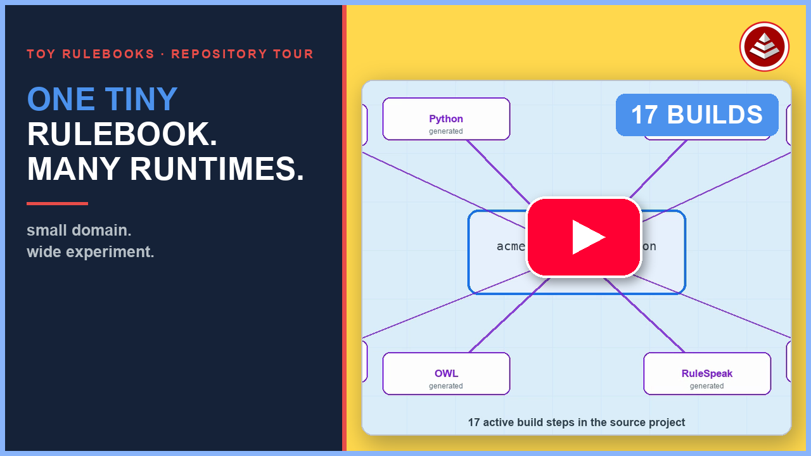
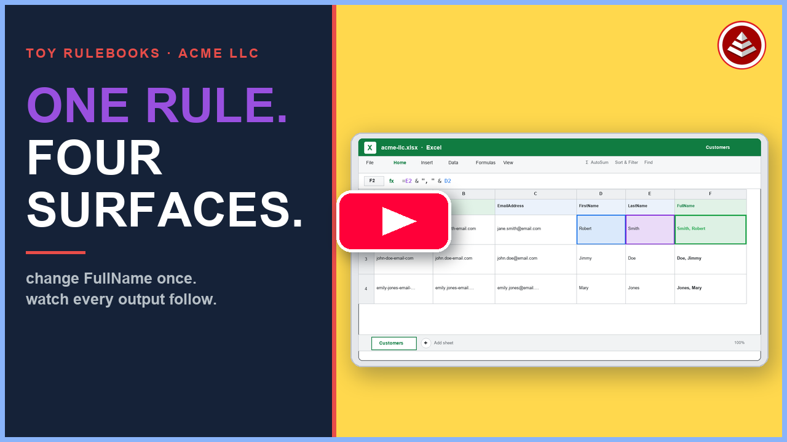

# Toy Rulebooks

These are demonstration toys — intentionally small domains whose job is to show the *breadth* of the platform, not the depth of a real domain.

## Watch the repository tour

▶ [**Play: One Rulebook, Many Runtimes | Toy Rulebooks Tour**](https://www.youtube.com/watch?v=XCOOBsLUlwU)

The video opens the ACME LLC rulebook, follows one formula into multiple generated runtimes, changes the rule once, and shows why generated files follow the rulebook rather than replace it. Learn more at [EffortlessAPI](https://www.effortlessapi.com/rulebook/).

## Watch the ACME LLC walkthrough

▶ [**Play: One Rulebook, Four Surfaces | ACME LLC Walkthrough**](https://www.youtube.com/watch?v=gggujL-g-G4)

Start the project, inspect `Customers.FullName` in the editor, Postgres, a custom customer app, and RuleSpeak, then rebuild once and watch the generated Excel workbook follow the same rule.

The defining property here is the **substrate matrix**: one rulebook, many runtimes. [acme-llc](acme-llc/) is the canonical example — one table and two calculated fields — run through all 17 substrates (Postgres, Python, Go, COBOL, Excel, OWL, English, and more), all conformant. The domain is simple by design so that what the demo brings is the *substrate matrix*, not the complexity of the subject matter.

Because this repo is also used as a live demonstration environment, some toy domains may show partially-completed loop steps at any given moment. A full `effortless build` on any domain resets it to its defined state.

## What lives here

| Domain | Purpose |
|---|---|
| [acme-llc](acme-llc/) | Canonical substrate breadth witness — 17 substrates, all conformant |
| [acme-corporation](acme-corporation/) | Five-table variant of the acme theme |
| [customer-fullname](customer-fullname/) | Hello World — single-table string concat formula |
| [nakedclaude-v1](nakedclaude-v1/) through [nakedclaude-v4](nakedclaude-v4/) | Progression showing the same problem solved without ERB (v1–v3) then with ERB (v4) |

The toys open the door. The [domain examples](../rulebook-examples/) show how far it actually goes.
